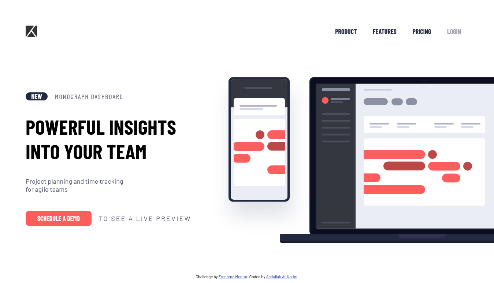
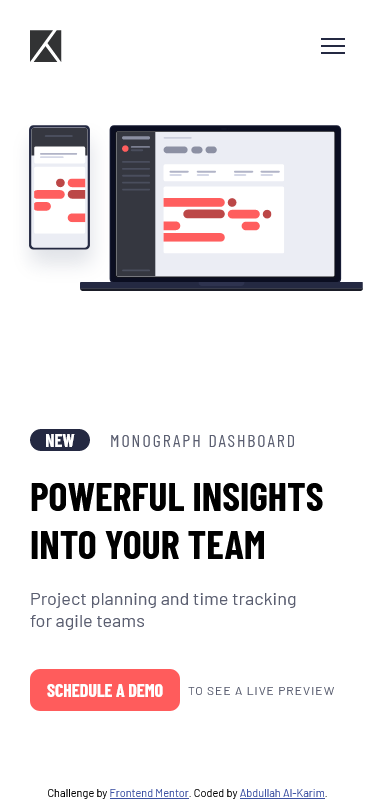
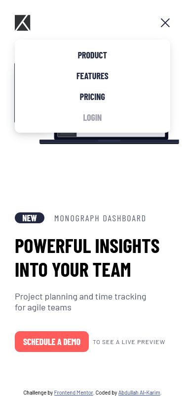

# Frontend Mentor - Project tracking intro component solution

This is a solution to the [Project tracking intro component challenge on Frontend Mentor](https://www.frontendmentor.io/challenges/project-tracking-intro-component-5d289097500fcb331a67d80e). Frontend Mentor challenges help you improve your coding skills by building realistic projects.

## Overview

### The challenge

Users should be able to:

- View the optimal layout for the site depending on their device's screen size
- See hover states for all interactive elements on the page
- Create the background shape using code

### Screenshot

- Desktop Screenshot

- Mobile Screenshot

-Active Stage

## My process

### Built with

- Semantic HTML5 markup
- CSS custom properties
- CSS grid
- Responsive design

### What I learned
First time designing hamburger menu

## Author

- Frontend Mentor - [@alkarim99](https://www.frontendmentor.io/profile/alkarim99)
- Twitter - [@a_alkarim_a](https://www.twitter.com/a_alkarim_a)
